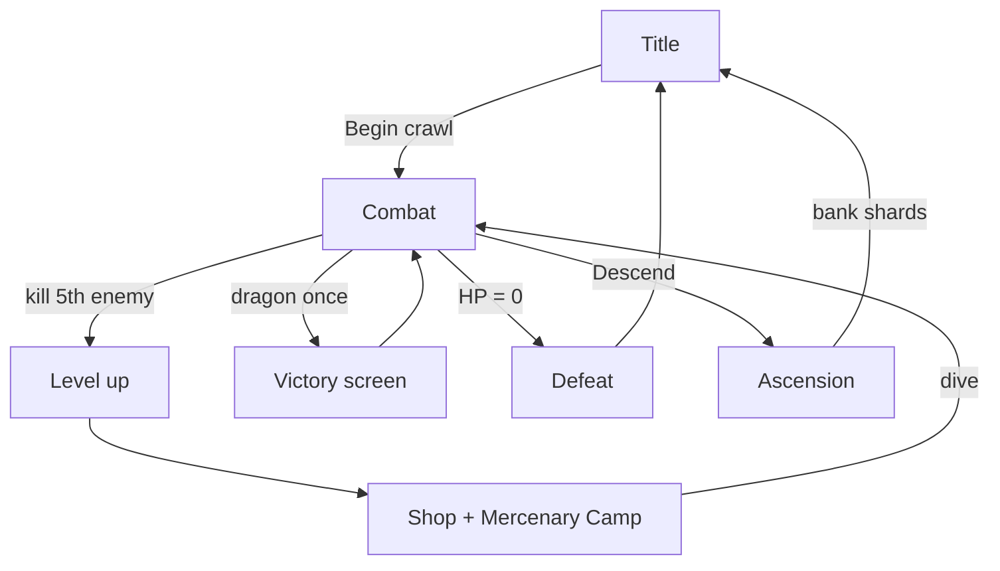

# AshVault — Systems Overview

High-level architecture for contributors. Detail lives in
[`game-design-spec.md`](game-design-spec.md).

---

## Core loop



**Hybrid idle:** `CombatView` drives `GameEngine.tick()` at `Balance.tickSeconds`
(~1 Hz). When `autoBattle` is on, combat (and, after first prestige, level-up /
shop) resolves automatically.

---

## Phase machine

`GameEngine.phase` (`Phase` enum) routes `ContentView`:

| Phase | View | Tick active? |
|-------|------|--------------|
| `.title` | `TitleView` | No |
| `.combat` | `CombatView` | Yes (if auto-battle) |
| `.levelUp` | `LevelUpView` | Yes (if automation unlocked) |
| `.shop` | `ShopView` + `MercenaryCampView` | Yes (if automation unlocked) |
| `.ascension` | `AscensionView` | No |
| `.victory` | `GameOverView(won: true)` | No |
| `.defeat` | `GameOverView(won: false)` | No |

---

## Three persistence layers

```
┌─────────────────────────────────────────────────────────┐
│  RUN (resets on death / ascension / new game)           │
│  Player stats, layer, gold, shop purchases, run gold    │
│  → SaveStore (JSON, combat/levelUp/shop only)           │
├─────────────────────────────────────────────────────────┤
│  PRESTIGE (permanent across runs)                       │
│  Soul Shards earned + Soul Tree levels spent            │
│  → PrestigeStore                                        │
├─────────────────────────────────────────────────────────┤
│  META (permanent across runs)                           │
│  Mercenary counts, relic collection, lifetime stats     │
│  → MetaStore                                            │
└─────────────────────────────────────────────────────────┘
         BestRun (layer/level/gold record) — separate
         AutoDescendSettings — global UserDefaults
```

On `GameEngine.init`, load order: `PrestigeStore` → `MetaStore` → `SaveStore`
(if resumable run exists, skip title).

---

## Damage pipeline

```
combatAttack = player.attack + mercenaryDPS

Player hits:
  attack/heavy: max(1, combatAttack × mult × crit − enemy.def)
  sigils:       max(1, (combatAttack + flatBonus) × effectiveness)  // ignores def; Venom Lash also stacks poison
  → vampiricFang: heal floor(dmg × 6%)

Enemy hits:
  mitigated = max(0, round(raw × (1 − wardDR)))
  → thornMail: reflect floor(dmg × 10%) to enemy

Gold on kill:
  base × fortuneMultiplier × goldToothMultiplier
```

---

## Model / view map

| Model | View(s) |
|-------|---------|
| `GameEngine` | All gameplay views |
| `Player`, `Enemy`, `Move` | `CombatView` |
| `SpellID`, `SigilLoadout` | `CombatView`, `SigilLoadoutView` |
| `ShopItem` | `ShopView` |
| `Mercenary` | `MercenaryCampView` (embedded in shop) |
| `Relic` | `RelicMuseumView`, `RelicFoundView` |
| `SkillNode` | `SkillTreeView` |
| `OfflineReport` | `OfflineReportView` |
| `Balance` | (constants only — no UI) |

---

## Key files

```
AshVault/Models/
  GameEngine.swift    State machine, combat, idle tick, meta hooks
  Balance.swift       All tuning constants
  GameSave.swift      Run snapshot + SaveStore + PrestigeStore
  MetaStore.swift     Mercenaries, relics, lifetime, AutoDescendSettings
  Mercenary.swift     Generator tiers + cost/DPS math
  Relic.swift         Collectible definitions
  SkillNode.swift     Soul Tree nodes
  Player.swift        Hero stats / economy
  Enemy.swift         Bestiary + scaling
```
